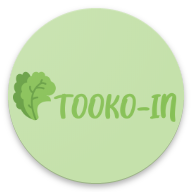

<h1 align="center">Tooko-in</h1>

<h3 align="center">React Native Mobile Apps</h3>

  

---

Tooko-in is E-commerce mobile apps focused on healthy and fresh product such as vegetables and fruits. Tookooin is heavily inspired by Sayurbox and followed by Shopee and Tokopedia as our reference.

---

### Build Depedencies

### Features

- Login and Register (as Buyer or Seller).
- Forget password using Phone OTP or Email.
- Guest can see all product without signed up.
- Search particular product by name.
- Buyer and Seller can response to an order, such as cancelling order, receiving product, sending product, etc.
- iPaymu Payment Method (Still on Development).

### Overview

  
      <image width="250" src="screenshot/login-page.jpg" />
      <image width="250" src="screenshot/register-page.jpg" />
      <image width="250" src="screenshot/home-buyer.jpg" /> 
  

  
      <image width="250" src="screenshot/profile-buyer.jpg" />
      <image width="250" src="screenshot/edit-profile.jpg" />
      <image width="250" src="screenshot/cart-buyer-loggedout.jpg" />
  

  
    <image width="250" src="screenshot/cart-buyer.jpg" />
    <image width="250" src="screenshot/checkout-page.jpg" />
      
  

  
    <image width="250" src="screenshot/ipaymu.jpg" />
    <image width="250" src="screenshot/order-buyer.jpg" />
  

## License

[ISC](https://en.wikipedia.org/wiki/ISC_license 'ISC')
